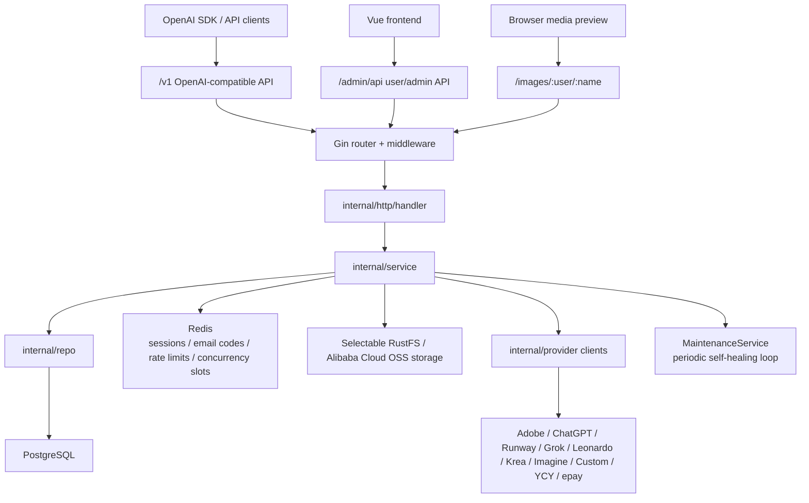

# Backend Architecture

This document is a persistent backend architecture map for future Codex sessions and new contributors.
It focuses on the Go backend under `backend/`, with enough frontend and deployment context to understand the runtime boundaries.

Last reviewed from local source on 2026-07-03.

## 1. High-Level Shape

`image2api` is a multi-provider AI image/video generation gateway. The backend exposes:

- OpenAI-compatible public API under `/v1`.
- User-facing and admin APIs under `/admin/api`.
- Private generated-media proxy under `/images/:user/:name`.
- Health endpoint under `/health`.

The backend is a layered Go service:



Important design choices:

- `bootstrap.NewApp` is the composition root. Most dependencies are created there.
- HTTP handlers are intentionally thin. They parse transport-level input and map service errors to HTTP responses.
- `service.V1Service` is the core generation orchestrator.
- Provider-specific code lives under `internal/provider/*`; scheduling and billing stay in service code.
- PostgreSQL is the source of truth for users, models, logs, accounts, settings, orders, CDK, and counters.
- Redis is used for ephemeral state: sessions, email codes, login/rate guard, and self-healing concurrency slots.
- RustFS or private Alibaba Cloud OSS stores generated media and uploaded reference images. `/images` always authorizes access first; OSS can then redirect authorized reads to a short-lived signed URL.

## 2. Runtime Entrypoint

Entry file: `backend/cmd/api/main.go`.

Startup flow:

1. Create root context.
2. Call `bootstrap.NewApp(ctx)`.
3. Start `http.Server` at `app.Config.HTTPAddr`.
4. Wait for `SIGINT` or `SIGTERM`.
5. Gracefully shut down HTTP server.
6. Call `app.Close()` to stop maintenance loop and close Redis/Postgres.

`main.go` does not wire business dependencies directly. All wiring is delegated to `internal/bootstrap/app.go`.

## 3. Composition Root

File: `backend/internal/bootstrap/app.go`.

`NewApp(ctx)` performs the full backend assembly:

1. Load config with `config.Load()`.
2. Ensure `GeneratedRoot` exists.
3. Open PostgreSQL with GORM and `TranslateError: true`.
4. Tune DB pool.
5. Run `AutoMigrate(model.AutoMigrateModels()...)`.
6. Create special partial unique index for marketing CDK redemption.
7. Seed default settings and backfill counters via `seedDefaults`.
8. Open Redis and ping it.
9. Instantiate repositories.
10. Ensure default concurrency group exists.
11. Instantiate services.
12. Instantiate the selected RustFS or OSS storage driver.
13. Instantiate upstream provider clients.
14. Create `V1Service` with model/user/event/token/settings/repo/provider/storage dependencies.
15. Wire Adobe refresh service back into `V1Service` with `SetRefresh`.
16. Create Gin engine through `router.New`.
17. Start `MaintenanceService.Run` in a goroutine.
18. Return `App`.

Dependency direction is mostly:

```text
cmd/api -> bootstrap -> router -> handler -> service -> repo/model/storage/provider
```

`bootstrap` is the only place where many concrete dependencies know about each other.

## 4. Configuration

File: `backend/internal/config/config.go`.

`config.Load()` loads `.env` before reading environment variables. Real environment variables win over `.env`.

Important config fields:

| Field | Env | Purpose |
|---|---|---|
| `AppEnv` | `APP_ENV` | Gin release mode outside development. |
| `HTTPAddr` | `HTTP_ADDR` | Backend listen address. |
| `AppTitle` | `APP_TITLE` | Default site title. |
| `PostgresDSN` | `POSTGRES_DSN` | PostgreSQL connection string. |
| `RedisAddr` | `REDIS_ADDR` | Redis host/port. |
| `RedisPassword` | `REDIS_PASSWORD` | Redis auth. |
| `RedisDB` | `REDIS_DB` | Redis database index. |
| `SessionCookieName` | `SESSION_COOKIE_NAME` | Configured cookie name, currently middleware reads `vivid_session` directly. |
| `CookieSecure` | `COOKIE_SECURE` | Secure cookie flag. |
| `SessionTTL` | `SESSION_TTL_HOURS` | Session lifetime. |
| `SessionSlideAfter` | `SESSION_SLIDE_AFTER_HOURS` | Sliding refresh threshold. |
| `CORSOrigins` | `CORS_ORIGINS` | Allowed frontend origins. |
| `GeneratedRoot` | `GENERATED_ROOT` | Legacy/generated root; current storage paths are RustFS-backed. |
| `StorageDriver` | `STORAGE_DRIVER` | `rustfs` (default) or `oss`. |
| `RustFSEndpoint` | `RUSTFS_ENDPOINT` | S3-compatible endpoint. |
| `RustFSBucket` | `RUSTFS_BUCKET` | Bucket name. |
| `RustFSAccessKey` | `RUSTFS_ACCESS_KEY` | S3 access key. |
| `RustFSSecretKey` | `RUSTFS_SECRET_KEY` | S3 secret key. |
| `OSSRegion` | `OSS_REGION` | OSS region, such as `cn-hongkong`. |
| `OSSEndpoint` | `OSS_ENDPOINT` | Optional official endpoint or HTTPS custom media domain. |
| `OSSBucket` | `OSS_BUCKET` | Private OSS bucket name. |
| `OSSAccessKeyID` | `OSS_ACCESS_KEY_ID` | Dedicated RAM identity access key ID. |
| `OSSAccessKeySecret` | `OSS_ACCESS_KEY_SECRET` | Dedicated RAM identity secret. |
| `OSSSessionToken` | `OSS_SESSION_TOKEN` | Optional STS session token. |
| `OSSUseCName` | `OSS_USE_CNAME` | Use the endpoint as an OSS-bound custom CNAME. |
| `OSSDirectDelivery` | `OSS_DIRECT_DELIVERY` | Return authorized HTTP 307 redirects to private signed OSS URLs. |
| `OSSSignedURLTTL` | `OSS_SIGNED_URL_TTL_SECONDS` | Signed GET lifetime; defaults to one hour and cannot exceed seven days. |
| `YCYBaseURL` | `YCY_BASE_URL` | YCY integration base URL. |
| `YCYAPIKey` | `YCY_API_KEY` | YCY integration API key. |

`seedDefaults` in `backend/internal/bootstrap/seed.go` seeds editable site settings such as:

- Site title/logo/contact.
- Registration and email-code settings.
- SMTP settings.
- Proxy URL.
- Credit/check-in/invite/CDK settings.
- epay settings.
- Log and media retention days.

## 5. Backend Directory Map

```text
backend/
  cmd/
    api/                 HTTP service entrypoint
    marklabel/           ops helper command
  internal/
    bootstrap/           app composition, migration, seed defaults
    config/              env and .env loading
    http/
      handler/           HTTP transport handlers
      middleware/        request ID and session/admin auth middleware
      router/            Gin route table
    model/               GORM data model definitions
    provider/            upstream API clients
    repo/                database access layer
    service/             business orchestration and domain services
    storage/             RustFS and Alibaba Cloud OSS object drivers
  Dockerfile             backend image build
  go.mod / go.sum        Go module and dependencies
```

## 6. HTTP Routing

Route registration lives in `backend/internal/http/router/router.go`.

### 6.1 Global Middleware

All routes use:

- `gin.Recovery()`.
- `middleware.RequestID()`.
- CORS configured from `cfg.CORSOrigins`, allowing credentials.

### 6.2 Public Non-Admin Routes

| Method | Path | Handler | Purpose |
|---|---|---|---|
| `GET` | `/health` | `Health.Handle` | Health check. |
| `GET` | `/images/:user/:name` | `Images.Serve` | Authorized media proxy or short-lived signed OSS redirect. |
| `GET` | `/v1/models` | `V1.Models` | OpenAI-compatible model list. |
| `POST` | `/v1/images/generations` | `V1.ImageGenerations` | OpenAI-compatible text-to-image. |
| `POST` | `/v1/images/edits` | `V1.ImageEdits` | OpenAI-compatible image edit / references. |
| `POST` | `/v1/videos` | `V1.CreateVideo` | OpenAI Sora-style async video job creation. |
| `GET` | `/v1/videos/:id` | `V1.GetVideo` | Poll video job status. |
| `GET` | `/v1/videos/:id/content` | `V1.GetVideoContent` | Stream completed video content. |

`/v1` authentication uses user API keys, not UI sessions.

### 6.3 Public `/admin/api` Routes

These are consumed by the public frontend without login:

| Method | Path | Purpose |
|---|---|---|
| `GET` | `/admin/api/site` | Public site settings. |
| `GET` | `/admin/api/showcase` | Homepage showcase items. |
| `GET` | `/admin/api/managed-models` | Public managed model list. |
| `GET` | `/admin/api/stats` | Public stats. |
| `GET` | `/admin/api/video-presets` | Video presets for UI. |
| `GET` | `/admin/api/catalog` | Generation catalog. |
| `GET` | `/admin/api/models` | User-visible models. |
| `GET/POST` | `/admin/api/pay/notify` | epay async callback, no session auth. |

### 6.4 Auth Routes

Base path: `/admin/api/auth`.

Unauthenticated:

- `GET /config`
- `POST /send-code`
- `POST /register`
- `POST /login`
- `POST /logout`
- `POST /reset-password`

Session-required routes are appended to the same group later:

- `GET /me`
- `GET /invites`
- `POST /checkin`
- `POST /change-password`
- `GET/POST/DELETE /api-key`
- `POST /redeem-cdk`

### 6.5 User-Authenticated Routes

Base path: `/admin/api`, middleware: `RequireSession`.

| Method | Path | Purpose |
|---|---|---|
| `GET` | `/logs` | User generation logs. |
| `POST` | `/generate` | User playground generation. |
| `POST` | `/test` | Admin-ish generation test via user flow. |
| `GET` | `/jobs/mine` | Current user's generation jobs. |
| `GET` | `/my-images` | Current user's generated media. |
| `GET` | `/announcement` | Active announcement for user. |
| `POST` | `/announcement/seen` | Mark announcement seen. |
| `GET` | `/pay/config` | Public recharge config. |
| `POST` | `/pay/recharge` | Create recharge order. |
| `GET` | `/pay/orders` | My recharge orders. |
| `GET` | `/pay/orders/:id` | Order status. |
| `POST` | `/pay/orders/:id/continue` | Continue unpaid order. |

### 6.6 Admin Routes

Base path: `/admin/api`, middleware: `RequireAdminSession`.

Major groups:

- Dashboard and stats: `/dashboard`, `/providers`, `/images`, `/logs`.
- Users: `/users`, credits, API keys, bulk delete.
- Invites: `/invites`.
- Concurrency groups: `/concurrency-groups`.
- Orders: `/pay/admin/orders`.
- CDK: `/cdks`.
- Provider accounts/tokens: `/tokens`, `/accounts`, `/refresh/profiles`.
- Model management: `/managed-models`.
- Showcase/homepage content: `/showcase`.
- Settings: `/settings/*`.

Settings endpoints include:

- Site settings.
- Logo and generic asset upload.
- Registration settings.
- SMTP settings and SMTP test.
- Proxy settings and proxy test.
- Credits/check-in/invite settings.
- Log retention.
- Media retention.
- Announcement.
- epay settings.

## 7. Handler Layer

Directory: `backend/internal/http/handler`.

Handlers translate HTTP details into service calls:

- Parse JSON or multipart form data.
- Read files and convert uploaded references to base64.
- Extract path/query parameters.
- Read current user from middleware context.
- Map domain/service errors to HTTP status codes.

Important handlers:

| Handler file | Purpose |
|---|---|
| `v1.go` | OpenAI-compatible `/v1` request/response shape. |
| `user_generation.go` | User playground generation, logs, jobs, catalog. |
| `auth.go` | Login/register/session/profile/check-in/API key/CDK user endpoints. |
| `provider_admin.go` | Token/account import, quota, refresh profile admin endpoints. |
| `admin_read.go` | Dashboard, users, logs, providers, images, invites. |
| `admin_write.go` | Admin writes for users, models, logs, showcase. |
| `payment.go` | Recharge, order status, admin orders, epay callback. |
| `images.go` | Private generated media proxy. |
| `app_settings.go` | Registration, SMTP, proxy, credits, retention, assets. |
| `announcement.go` | User/admin announcement endpoints. |
| `concurrency_group.go` | Admin concurrency group CRUD. |
| `cdk.go` | Admin CDK endpoints. |

## 8. Service Layer Overview

Directory: `backend/internal/service`.

Service files and responsibilities:

| File | Responsibility |
|---|---|
| `v1.go` | Core generation orchestration: auth, model validation, charging, logging, scheduling, provider dispatch, refunds. |
| `user_generation.go` | User/admin playground wrapper around `V1Service`, job/log shaping. |
| `auth.go` | UI session auth, registration, login, password reset, check-in, invite info, media authorization. |
| `session.go` | Redis-backed session create/validate/destroy/sliding behavior. |
| `api_key.go` | User API key mint/get/delete. |
| `tokens.go` | Provider account import/list/update/delete/quota/email, token refresh helpers. |
| `refresh_profiles.go` | Adobe cookie refresh profile management and scheduled refresh. |
| `maintenance.go` | Periodic self-healing loop. |
| `concurrency.go` | Redis ZSET/Lua concurrency limiter. |
| `concurrency_group.go` | Admin concurrency group CRUD and default group behavior. |
| `payment.go` | epay settings, order creation, callback handling, order listing. |
| `cdk.go` | CDK generation/redeem/delete, marketing batch rule. |
| `admin_read.go` | Admin dashboard, stats, logs, images, providers, invites. |
| `admin_write.go` | Admin user/model/showcase/log mutations. |
| `app_settings.go` | Site assets, registration, SMTP, proxy, credit, retention settings. |
| `announcement.go` | Announcement read/write and seen tracking. |
| `site.go` | Public site settings. |
| `showcase.go` | Showcase listing. |
| `image_access.go` | Media access helper. |
| `email_code.go` | Redis email-code issue/verify. |
| `login_guard.go` | Login/reset abuse guard. |
| `rate_limit.go` | Generic Redis rate limiter. |
| `smtp.go` | SMTP email sending. |
| `password.go` | Password hashing/verification. |
| `validation.go` | Email/username/password/code validation. |
| `alphabet.go` | Random ID/string helpers. |

## 9. Core Generation Architecture

File: `backend/internal/service/v1.go`.

`V1Service` is the center of the backend. It owns:

- Repositories: models, users, events, tokens, site settings, concurrency groups.
- Provider clients: Adobe, ChatGPT, Runway, Leonardo, Krea, Imagine, Grok, Custom, YCY.
- Storage client.
- Redis-backed concurrency service.
- Round-robin token cursors.
- In-flight generation registry for maintenance cancellation.
- Optional Adobe refresh service.

### 9.1 Image Generation Flow

Public OpenAI path:

```text
POST /v1/images/generations or /v1/images/edits
  -> handler.V1Handler
  -> V1Service.Authenticate(API key)
  -> V1Service.PrepareImageRequest
  -> prepareImageExecution(source="v1", charge=true)
```

User playground path:

```text
POST /admin/api/generate
  -> handler.UserGenerationHandler
  -> UserGenerationService.Generate
  -> V1Service.prepareSessionImage or prepareSessionVideo
```

Internal image execution:

1. Detach bookkeeping context from HTTP request cancellation with `context.WithoutCancel`.
2. Create a cancellable generation context with an 8-minute timeout.
3. Acquire per-user concurrency slot unless source is admin.
4. Validate model, prompt, type, provider availability, reference count, reference size.
5. Derive aspect ratio and resolution from OpenAI `size` or UI fields.
6. Calculate price using `ModelConfig.Prices` or agent price overlay.
7. Debit user credits atomically if charging.
8. Save reference images to RustFS/S3 as transient objects.
9. Create pending `EventLog`.
10. Register event in `InflightRegistry`.
11. Dispatch to effective provider.
12. On provider error: refund if needed, mark event failed, map error to domain error.
13. On success:
    - `/v1` source returns base64 inline and does not store output media.
    - UI source uploads output bytes to RustFS and returns `/images/...` URL.
14. Mark event success.
15. Increment model and user generation counters.
16. Possibly grant invite reward.
17. Clean up transient reference images.

### 9.2 Video Generation Flow

There are two video execution styles:

1. Synchronous-style internal execution through `prepareVideoExecution`.
2. OpenAI Sora-style async job through `StartVideoJob`, `VideoJob`, and `OpenVideoContent`.

Async `/v1/videos` flow:

```text
POST /v1/videos
  -> authenticate API key
  -> prepareVideo(validate, price, debit)
  -> save refs
  -> create pending EventLog
  -> goroutine runVideoJob
  -> return { id, object:"video", status:"queued" }

GET /v1/videos/:id
  -> load caller-owned EventLog
  -> map EventLog status to queued/in_progress/completed/failed

GET /v1/videos/:id/content
  -> require EventLog success
  -> stream stored upstream URL
```

For async jobs, the backend stores the upstream video URL in `EventLog.File` when complete. It does not download and persist the video. `OpenVideoContent` proxies it on demand.

Special case:

- Grok asset URLs are auth-gated, so `/content` reuses the same generating account's token via `EventLog.AccountID`.

### 9.3 Effective Provider Resolution

`ModelConfig.Provider` names the native provider. `V1Service.effectiveProvider` can override routing:

- If a `custom` upstream account declares it serves a model ID, that model can route to `custom`.
- If a `ycy` account declares it serves a video model ID, that model can route to `ycy`.
- Otherwise the native provider is used.

This lets admins connect OpenAI-compatible upstreams or YCY accounts without adding a new first-class provider per model.

### 9.4 Account Pool Scheduling

Provider accounts are `TokenAccount` rows. Scheduling is implemented by:

- `generate*` methods selecting active accounts for a pool.
- `rotateRoundRobin` ordering accounts by weight and cursor.
- `runPoolWithFailover` trying accounts.
- `tryAccount` applying same-account retry/failover rules.

Rules:

- Higher `TokenAccount.Weight` is preferred.
- Same weight uses strict round-robin cursor per pool.
- Built-in accounts default to 1 concurrent job per account.
- Grok allows 10 concurrent jobs per account.
- Custom/YCY account concurrency can be set via `TokenAccount.Concurrency`.
- Busy accounts are skipped; if every eligible account is busy, caller gets `ErrConcurrencyFull`.
- Quota errors mark the account limited and fail over.
- Auth errors may refresh once, then mark the account failed/dead and fail over.
- Temporary errors usually retry the same account up to 3 times.
- Adobe temporary errors can mark accounts dead and fail over, capped to avoid disabling the whole pool during provider-wide incidents.
- Request/parameter errors fail fast and do not penalize accounts.

### 9.5 Credit Billing

Charging happens before generation:

1. `modelPrice` reads normal or agent price from `ModelConfig`.
2. `chargeForModel` calls `UserRepository.TryDebitCredits`.
3. Event row records `Cost`.
4. Failure path calls `refundIfNeeded`.
5. `EventLog.Refunded` prevents double refunds.
6. Maintenance can refund stale pending jobs after process crashes.

Agent pricing:

- If `User.Role == "agent"`, `PricesAgent` and `DurationPricesAgent` overlay normal prices.
- Missing agent price falls back to normal price.

## 10. Concurrency Architecture

File: `backend/internal/service/concurrency.go`.

Concurrency is Redis-backed and intentionally self-healing.

Data structure:

- Redis sorted set per subject.
- Key examples:
  - User: `conc:u:<userID>`.
  - Account: `conc:a:<accountID>`.
- Member: unique generation token or event ID.
- Score: expiry timestamp.

Acquire flow:

1. Lua script gets Redis server time.
2. Removes expired members.
3. Counts current members.
4. If max is nonzero and count is at max, reject.
5. Adds member with `now + ttl`.
6. Sets key expiry.

Properties:

- TTL is 15 minutes.
- Redis unavailable means fail-open, so generation is not blocked by Redis outage.
- Lost release from crash is healed by TTL expiry.
- Same service is reused for user-level and account-level concurrency.

## 11. In-Flight Registry

`V1Service` owns `InflightRegistry`.

Purpose:

- Map `eventID -> context.CancelFunc`.
- Normal generation registers when work starts and deregisters on finish.
- `MaintenanceService` can cancel stuck generation work when it marks the event abandoned.

This prevents late success writes after a stale pending row has already been failed/refunded.

## 12. Data Model

File: `backend/internal/model/models.go`.

### 12.1 Core Tables

| Model | Purpose |
|---|---|
| `User` | App user, role, status, credits, invite/check-in state, concurrency group, counters. |
| `APIKey` | Per-user API keys, stored by hash and preview. |
| `ModelConfig` | Admin-managed model catalog, provider, pricing, ratios, resolutions, duration pricing, agent pricing. |
| `TokenAccount` | Provider account/token/cookie/upstream account with status, quota state, metadata, weight, concurrency. |
| `EventLog` | Generation request log and job state: kind, status, model, provider, prompt, params, refs, account, user, cost, file, error. |
| `RefreshProfile` | Refreshable provider credentials, primarily Adobe cookies. |
| `SiteSetting` | Key-value editable configuration. |
| `Order` | epay recharge order and payment status. |
| `CDKCode` | Redeemable credit code; supports normal and marketing types. |
| `ConcurrencyGroup` | Per-user max simultaneous generations. |
| `ShowcaseItem` | Public homepage/gallery showcase item. |
| `StatCounter` | Persistent all-time dashboard counters independent of pruned event logs. |

### 12.2 Important Status Values

`User.Role`:

- `user`
- `agent`
- `admin`

`User.Status`:

- typically `active`; inactive users fail auth.

`EventLog.Status`:

- `pending`
- `success`
- `failed`

`EventLog.Kind`:

- `image`
- `video`

`EventLog.Source`:

- `v1` for OpenAI-compatible API calls.
- `user` for frontend playground calls.
- `admin` for admin tests.

`TokenAccount.Status`:

- `active`
- `disabled`
- `quota`
- pending/import-specific states may be used during account checks.

`Order.Status`:

- `pending`
- `paid`
- `cancelled`

### 12.3 Notable Index and Consistency Rules

`bootstrap.NewApp` creates a partial unique index:

```sql
CREATE UNIQUE INDEX IF NOT EXISTS uniq_cdk_marketing_batch_user
ON cdk_codes (batch_id, redeemed_by)
WHERE type = 'marketing' AND redeemed_by IS NOT NULL
```

Purpose: enforce one marketing CDK redemption per user per batch, even under concurrent redemption.

`EventLog.Refunded` is used as an exactly-once refund claim flag.

`StatCounter`, `User.GenerationCount`, and `ModelConfig.GenerationCount` keep lifetime counts independent from event-log retention cleanup.

## 13. Repository Layer

Directory: `backend/internal/repo`.

Repositories are thin GORM access wrappers.

| File | Aggregate |
|---|---|
| `user_repo.go` | Users, credit debit/adjust, login, API-key lookup, invite/check-in helpers. |
| `api_key_repo.go` | API key CRUD and usage touch. |
| `model_repo.go` | Model config list/get/create/update/delete and generation count. |
| `event_repo.go` | Generation logs, stats, pending purge, status/file/refund updates. |
| `token_repo.go` | Provider account/token CRUD, quota recovery, reset markers, fail counters. |
| `refresh_profile_repo.go` | Refresh profile CRUD and due lookup. |
| `site_setting_repo.go` | Cached site setting key-value access. |
| `showcase_repo.go` | Showcase CRUD and pinned media lookup. |
| `cdk_repo.go` | CDK generation/list/redeem/delete. |
| `order_repo.go` | Recharge order create/list/mark-paid/expire. |
| `concurrency_group_repo.go` | Concurrency groups and default binding. |

## 14. Provider Layer

Directory: `backend/internal/provider`.

Each provider client handles HTTP details, auth headers, payload shape, polling, downloads, quota checks, and provider-specific error mapping.

| Provider | Directory | Purpose |
|---|---|---|
| Adobe Firefly | `adobe/` | Adobe image/video generation, auth, payloads, util. |
| ChatGPT/OpenAI | `chatgpt/` | ChatGPT image generation, PoW/turnstile-related helpers. |
| Runway | `runway/` | Runway video and image generation, credits, token helpers. |
| Grok | `grok/` | Grok video generation, assets, session/account helpers. |
| Leonardo | `leonardo/` | Leonardo image generation and credits. |
| Krea | `krea/` | Krea image generation, cookie/session refresh and activation. |
| Imagine | `imagine/` | Imagine image generation and token refresh. |
| Custom | `custom/` | OpenAI-compatible upstream adapter. |
| YCY | `ycy/` | YCY video adapter. |
| epay | `epay/` | Payment order creation and MD5 callback verification. |

Provider errors are normalized into provider package sentinel errors such as:

- `ErrAuth`
- `ErrQuotaExhausted`
- `ErrTemporaryUpstream`

`V1Service` maps those provider errors to service-level errors:

- `ErrProviderAuth`
- `ErrProviderQuota`
- `ErrProviderTemporary`
- `ErrProviderExecution`
- `ErrNoProviderAccount`
- `ErrConcurrencyFull`

## 15. Storage and Media Access

Files: `backend/internal/storage/client.go`, `rustfs.go`, and `oss.go`.

`storage.Client` delegates the shared media operations to either the existing
RustFS/S3-compatible driver or the official Alibaba Cloud OSS Go SDK v2 driver:

- `Put`
- `Get`
- `Delete`
- `List`
- `Exists`
- `PublicURL` helper
- private `PresignGet` capability for OSS

Generated media behavior:

- UI-generated images/videos are uploaded to the selected storage driver.
- `/v1` image calls return base64 and do not persist output files.
- Async `/v1/videos` stores upstream URL in `EventLog.File`, not the bytes.
- Uploaded reference images are stored transiently and deleted after generation.
- `/images/:user/:name` always performs backend authorization first.
- RustFS and OSS proxy mode stream bytes through the backend.
- OSS direct mode returns a non-cacheable HTTP 307 to a short-lived signed GET
  URL after checking object existence. The redirect preserves browser `Range`
  requests so video seeking goes directly to OSS.
- Missing thumbnail and last-frame objects still fall back to the original key.

Access model:

- Regular user can view only their own media directory.
- Admin can view all media.
- The bucket remains private and browsers never receive write credentials.
- `STORAGE_DRIVER` and `OSS_DIRECT_DELIVERY` are independent rollback switches.
- Access is based on UI session cookie, not API key.
- Media owner directory is derived from sanitized username, email local-part, or user ID.

## 16. Auth Architecture

Files:

- `backend/internal/service/auth.go`
- `backend/internal/service/session.go`
- `backend/internal/service/email_code.go`
- `backend/internal/service/login_guard.go`
- `backend/internal/http/middleware/auth.go`

There are two auth systems:

### 16.1 UI Session Auth

Used by `/admin/api`.

- Login creates Redis session.
- Frontend stores token in localStorage and sends `Authorization: Bearer <token>`.
- Middleware also checks `vivid_session` cookie.
- `RequireSession` requires active user.
- `RequireAdminSession` additionally requires `User.Role == "admin"`.
- Session can slide/refresh based on configured TTL thresholds.

### 16.2 API Key Auth

Used by `/v1`.

- API key belongs to a user.
- Plain key is shown once on mint.
- DB stores `sha256:<hex>` hash and preview.
- `/v1` requests use `Authorization: Bearer <api-key>`.
- User must be active.

## 17. Payment Architecture

Files:

- `backend/internal/service/payment.go`
- `backend/internal/provider/epay/client.go`
- `backend/internal/repo/order_repo.go`

Recharge flow:

```text
User POST /admin/api/pay/recharge
  -> PaymentService.CreateOrder
  -> validate pay settings/method/amount
  -> create local pending Order
  -> call epay create API
  -> store pay info / qrcode / trade no

epay GET/POST /admin/api/pay/notify
  -> verify MD5 signature
  -> require TRADE_SUCCESS
  -> MarkPaid idempotently
  -> add user credits
  -> increment user recharge_total
```

Unpaid order behavior:

- Order TTL is 30 minutes.
- Maintenance expires stale pending orders.
- `Continue` returns still-valid pay info or creates a fresh order from the old amount/method.

## 18. CDK and Invite/Credit Operations

CDK:

- Service: `CDKService`.
- Model: `CDKCode`.
- Admin can generate/delete/list.
- User can redeem when `credits.cdk_redeem_enabled` permits it.
- Marketing CDK has batch-level one-per-user constraint enforced by partial unique index.

Invite/check-in:

- User has `InviteCode`, `InvitedBy`, `InviteRewardDone`.
- Check-in fields: `CheckinLast`, `CheckinStreak`.
- Credit settings live in `SiteSetting` keys:
  - `credits.checkin_enabled`
  - `credits.checkin_reward`
  - `credits.invite_enabled`
  - `credits.invite_reward`
  - `credits.cdk_redeem_enabled`

## 19. Maintenance Loop

File: `backend/internal/service/maintenance.go`.

Runs every 60 seconds and also runs once immediately on startup.

Responsibilities:

1. Expire pending recharge orders past TTL.
2. Recover quota-exhausted tokens whose reset time has passed.
3. Re-sync quota/balance for recovered accounts.
4. Roll active daily-reset account markers forward.
5. Expire Runway tokens after JWT reset/expiry time.
6. Refresh expiring Krea/Imagine rotating sessions.
7. Activate Krea daily when needed.
8. Refresh due Adobe cookie profiles.
9. Purge stale pending generation events after 10 minutes.
10. Cancel in-flight work for abandoned events.
11. Refund abandoned events exactly once.
12. Increment fail count for abandoned account-bound events.
13. Prune old logs by `logs.retention_days`.
14. Prune old media by `media.retention_days`.
15. Preserve showcase-pinned media and site logo.
16. Clear event file references when media is deleted.

This loop is important for process-crash recovery and long-term storage hygiene.

## 20. Admin and User Frontend Boundary

Frontend is in `frontend/`, but the backend API shape is designed around:

- Public pages calling public `/admin/api` endpoints.
- Logged-in user pages calling session-protected `/admin/api` endpoints.
- Admin pages calling admin-protected `/admin/api` endpoints.
- OpenAI-compatible external clients calling `/v1`.

Important frontend-to-backend mappings:

| Frontend area | Backend APIs |
|---|---|
| Home/public site | `/admin/api/site`, `/admin/api/showcase`, `/admin/api/stats` |
| Playground | `/admin/api/catalog`, `/admin/api/models`, `/admin/api/generate`, `/admin/api/jobs/mine` |
| User logs/gallery | `/admin/api/logs`, `/admin/api/my-images`, `/images/...` |
| Settings/API key | `/admin/api/auth/me`, `/admin/api/auth/api-key`, `/admin/api/auth/change-password` |
| Recharge/orders | `/admin/api/pay/config`, `/admin/api/pay/recharge`, `/admin/api/pay/orders` |
| Admin overview | `/admin/api/dashboard`, `/admin/api/providers` |
| Admin models | `/admin/api/managed-models` |
| Admin accounts | `/admin/api/tokens`, `/admin/api/accounts`, `/admin/api/refresh/profiles` |
| Admin users | `/admin/api/users`, `/admin/api/concurrency-groups` |
| Admin config | `/admin/api/settings/*` |

## 21. Deployment Topology

Current project builds through Docker.

`docker-compose.yml` defines:

- `postgres`: PostgreSQL 16.
- `redis`: Redis 7 with appendonly.
- `rustfs`: default local/rollback S3-compatible object storage.
- `createbucket`: one-shot MinIO client bucket creation.
- `backend`: Go service, listens at `0.0.0.0:6666`.
- `web`: frontend nginx, host port `2000`.

Typical request path in Docker deployment:

```text
Browser / API client
  -> user's reverse proxy / TLS termination
  -> frontend nginx container on host:2000
  -> static Vue assets OR proxy to backend:6666
  -> backend
  -> Postgres / Redis / selected RustFS or OSS storage / upstream providers
```

TLS is intentionally handled by the user's own reverse proxy, not by this project.

## 22. Adding a New Native Provider

To add a new first-class provider, follow this path:

1. Create `backend/internal/provider/<provider>/`.
2. Implement a client with:
   - constructor,
   - proxy setter if needed,
   - generation method(s),
   - quota/account info methods if admin account UI should support them,
   - sentinel errors for auth/quota/temp failures.
3. Add provider client construction in `bootstrap.NewApp`.
4. Add it to `service.NewV1Service` arguments and `V1Service` struct.
5. Add provider branch in:
   - image execution switch if image capable,
   - video execution switch if video capable,
   - async video `runVideoJob` switch if video capable.
6. Add active-account selection and `generate<Provider>Image/Video`.
7. Map provider errors in handler/service error classification.
8. Add import/account handling in `TokenService` and `ProviderAdminHandler`.
9. Ensure `ModelConfig.Provider` values and admin UI model/provider lists include it.
10. Add tests for request payload mapping and error classification.

For OpenAI-compatible upstreams, prefer using the existing `custom` provider instead of adding native code.

## 23. Adding a New Model

Most built-in/custom model additions should not require code changes.

Admin-managed `ModelConfig` controls:

- `ID`
- `Type`: `image` or `video`
- `Name`
- `Provider`
- `Enabled`
- `Ratios`
- `Prices`
- `Resolutions`
- `ImageToImage`
- `DurationPrices`
- `PricesAgent`
- `DurationPricesAgent`
- `Durations`
- `MaxReferenceImages`
- `ReferenceMode`
- `UpstreamModel`
- `Weight`

For custom upstreams:

- Add or update a `custom` account with `base_url`, `api_key`, and served model IDs.
- Create a `ModelConfig` whose provider can be native or custom-routed.
- `effectiveProvider` will route to `custom` if an active custom account serves the model ID.

For YCY:

- Add or update a `ycy` account with base URL, API key, served model IDs, weight, and concurrency.
- YCY currently participates in video flow.

## 24. Error Mapping

`handler.V1Handler.writeV1Error` maps service errors to HTTP responses.

Important mappings:

| Service error | HTTP |
|---|---|
| `ErrUnknownModel` | `404` |
| `ErrUnsupportedParams` | `400` |
| `ErrInsufficientFunds` | `402` |
| `ErrReferenceTooLarge` | `413` |
| `ErrNoProviderAccount` | `503` |
| `ErrProviderAuth` | `503` |
| `ErrProviderQuota` | `401` |
| `ErrProviderTemporary` | `503` |
| `ErrConcurrencyFull` | `429` |
| `ErrUserConcurrencyFull` | `429` |
| `ErrVideoJobNotFound` | `404` |
| `ErrVideoNotReady` | `409` |
| `ErrProviderUnsupported` | `501` |
| `ErrProviderExecution` | `502` |
| `ErrGenerationPending` | `501` with payload |

Note: provider quota maps to `401` for compatibility with the older contract.

## 25. Important Cross-Cutting Invariants

- Do not bypass `V1Service.chargeForModel`; it centralizes pricing and debit.
- Always create an `EventLog` for generation attempts after successful validation/charging.
- Always refund through `refundIfNeeded` or equivalent exactly-once logic.
- Do not expose private storage objects without first passing `/images` authorization; OSS direct delivery must use expiring signed GET URLs.
- Do not store plaintext API keys; store only hash and preview.
- New user-facing generation paths should use the same user concurrency gate.
- New provider paths should use account concurrency and failover helpers.
- Reference images should be treated as transient and cleaned up after generation.
- Admin tests should not charge credits and are exempt from user concurrency.
- Maintenance must be kept running in production; it is part of correctness, not only cleanup.

## 26. Quick File Reference

Start here for future investigation:

| Need | File |
|---|---|
| How the app starts | `backend/cmd/api/main.go` |
| Dependency wiring | `backend/internal/bootstrap/app.go` |
| Default settings/migrations extras | `backend/internal/bootstrap/seed.go` |
| All routes | `backend/internal/http/router/router.go` |
| OpenAI API transport | `backend/internal/http/handler/v1.go` |
| Core generation logic | `backend/internal/service/v1.go` |
| User playground wrapper | `backend/internal/service/user_generation.go` |
| Auth/session behavior | `backend/internal/service/auth.go`, `session.go` |
| Admin account import/quota | `backend/internal/service/tokens.go` |
| Scheduled self-healing | `backend/internal/service/maintenance.go` |
| Concurrency limiter | `backend/internal/service/concurrency.go` |
| Payment/recharge | `backend/internal/service/payment.go`, `backend/internal/provider/epay/client.go` |
| Data model | `backend/internal/model/models.go` |
| Storage client | `backend/internal/storage/client.go`, `rustfs.go`, `oss.go` |
| Provider clients | `backend/internal/provider/*` |
| Docker runtime | `docker-compose.yml` |

## 27. Known Local Verification Note

At the time this document was created, the local shell did not have the `go` command on `PATH`, so `go test ./...` could not be run from this environment. The architecture map is source-derived, not test-verified.
