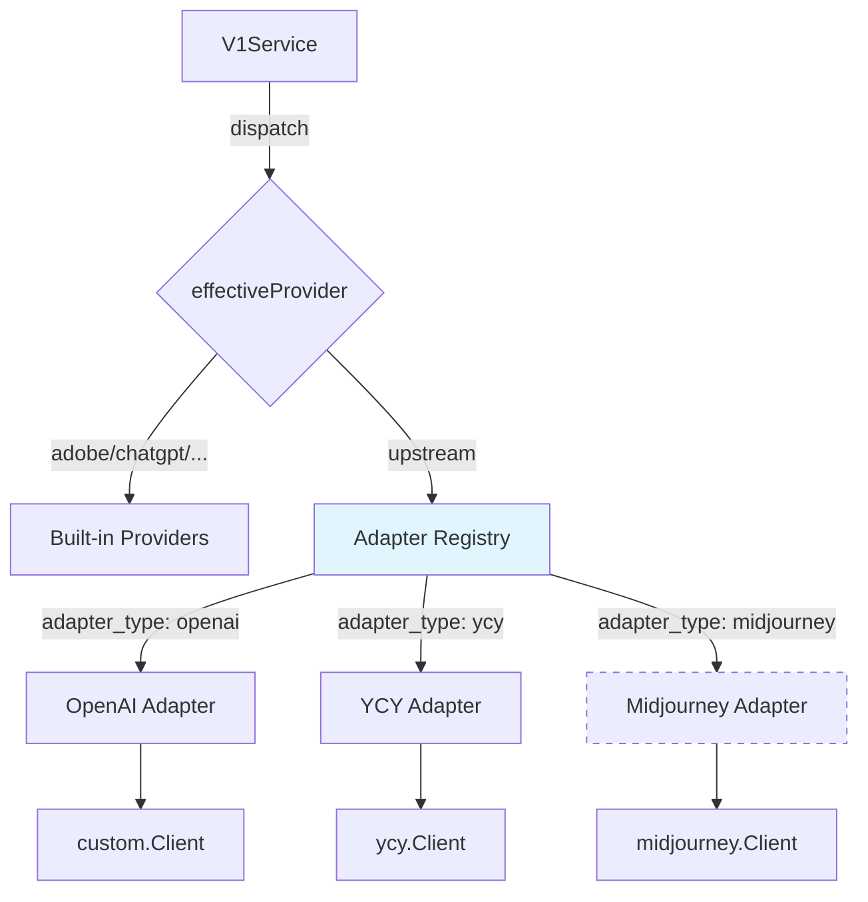

# Upstream Adapter Architecture Refactor

**Date**: 2026-07-03  
**Status**: Proposed  
**Estimated Effort**: 2 days initial implementation, 0.5 days per new format thereafter

## Executive Summary

Refactor the current provider dispatch system to use a plugin-style adapter architecture, reducing the cost of adding new user-configurable upstream formats from **6 code locations** to **2 locations** (implement interface + 1-line registration).

## Current Problem

Every time we add a new user-configurable upstream protocol format (like `custom` for OpenAI, `ycy` for YCY), we must modify:

1. `V1Service` struct - add a new client field
2. `bootstrap/app.go` - construct and inject the client
3. `service/v1.go` - add case to image switch
4. `service/v1.go` - add case to video switch  
5. `service/v1.go` - add case to async video switch
6. Error mapping - add `errors.Is(execErr, newpkg.ErrXxx)` checks
7. `tokens.go` / `handler/provider_admin.go` - add admin import support

This is a **"change 6+ places per format"** pattern. Since `custom` (OpenAI) and `ycy` are fundamentally just **HTTP wire format adapters**, they shouldn't require this much weight.

## Proposed Solution

### Core Concept

Separate "protocol format" from "provider pool name" by:
1. Making format an attribute on the account (via `TokenAccount.Metadata` or new column)
2. Defining a unified `UpstreamAdapter` interface
3. Registering adapters in a map at bootstrap
4. Unifying the three dispatch switches into one adapter lookup

### Architecture Diagram



## Implementation Plan

### Phase 1: Interface Definition

**File**: `backend/internal/service/upstream_adapter.go` (~20 lines)

```go
package service

import "context"

// UpstreamAdapter is the interface every user-configured upstream format must
// implement. Adding a new wire protocol means implementing this interface —
// no changes to v1.go dispatch are needed.
type UpstreamAdapter interface {
    // GenerateImage calls the upstream image generation API and returns raw bytes.
    // refs contains decoded reference image bytes (PNG/JPEG/WebP).
    GenerateImage(ctx context.Context, baseURL, apiKey, upstreamModel, prompt, size, quality string, refs [][]byte) ([]byte, error)
    
    // GenerateVideo calls the upstream video generation API.
    // When downloadResult=false, returns only the content URL (no bytes).
    // refs contains decoded reference/frame image bytes.
    GenerateVideo(ctx context.Context, baseURL, apiKey, upstreamModel, prompt, ratio string, refs [][]byte, downloadResult bool) ([]byte, string, error)
}

// Sentinel errors that all adapters must use for uniform error handling
var (
    ErrAdapterAuth              = errors.New("adapter: authentication failed")
    ErrAdapterQuotaExhausted    = errors.New("adapter: quota exhausted")
    ErrAdapterTemporaryUpstream = errors.New("adapter: temporary upstream error")
    ErrAdapterUnsupported       = errors.New("adapter: operation not supported")
)
```

**Alternative: Split Interfaces** (recommended for flexibility)

```go
type ImageAdapter interface {
    GenerateImage(ctx context.Context, baseURL, apiKey, upstreamModel, prompt, size, quality string, refs [][]byte) ([]byte, error)
}

type VideoAdapter interface {
    GenerateVideo(ctx context.Context, baseURL, apiKey, upstreamModel, prompt, ratio string, refs [][]byte, downloadResult bool) ([]byte, string, error)
}

// UpstreamAdapter combines both - adapters can implement one or both
type UpstreamAdapter interface {
    ImageAdapter
    VideoAdapter
}
```

### Phase 2: Adapter Implementations

#### 2.1 OpenAI Adapter

**File**: `backend/internal/provider/custom/adapter.go` (~40 lines)

```go
package custom

import (
    "context"
    "backend/internal/service"
)

// Adapter wraps the existing custom.Client to implement service.UpstreamAdapter
type Adapter struct {
    *Client
}

func NewAdapter() *Adapter {
    return &Adapter{Client: NewClient()}
}

func (a *Adapter) GenerateImage(ctx context.Context, baseURL, apiKey, upstreamModel, prompt, size, quality string, refs [][]byte) ([]byte, error) {
    b, err := a.Client.GenerateImage(ctx, baseURL, apiKey, upstreamModel, prompt, size, quality, refs)
    if err != nil {
        return nil, mapAdapterError(err)
    }
    return b, nil
}

func (a *Adapter) GenerateVideo(ctx context.Context, baseURL, apiKey, upstreamModel, prompt, ratio string, refs [][]byte, downloadResult bool) ([]byte, string, error) {
    // Note: GenerateVideo expects size (like "1280x720") not ratio
    // Convert ratio to size if needed, or update the interface
    size := ratioToSize(ratio) // helper function
    seconds := 0 // extract from duration if needed
    
    b, url, err := a.Client.GenerateVideo(ctx, baseURL, apiKey, upstreamModel, prompt, size, seconds, downloadResult)
    if err != nil {
        return nil, "", mapAdapterError(err)
    }
    return b, url, nil
}

func mapAdapterError(err error) error {
    switch {
    case errors.Is(err, ErrAuth):
        return fmt.Errorf("%w: %v", service.ErrAdapterAuth, err)
    case errors.Is(err, ErrQuotaExhausted):
        return fmt.Errorf("%w: %v", service.ErrAdapterQuotaExhausted, err)
    case errors.Is(err, ErrTemporaryUpstream):
        return fmt.Errorf("%w: %v", service.ErrAdapterTemporaryUpstream, err)
    default:
        return err
    }
}
```

#### 2.2 YCY Adapter

**File**: `backend/internal/provider/ycy/adapter.go` (~60 lines)

```go
package ycy

import (
    "context"
    "fmt"
    "backend/internal/service"
    "backend/internal/storage"
)

type Adapter struct {
    *Client
    store *storage.Client // needed to upload temp refs
}

func NewAdapter(store *storage.Client) *Adapter {
    return &Adapter{
        Client: NewClient(),
        store:  store,
    }
}

func (a *Adapter) GenerateImage(ctx context.Context, baseURL, apiKey, upstreamModel, prompt, size, quality string, refs [][]byte) ([]byte, error) {
    // YCY currently only supports video
    return nil, service.ErrAdapterUnsupported
}

func (a *Adapter) GenerateVideo(ctx context.Context, baseURL, apiKey, upstreamModel, prompt, ratio string, refs [][]byte, downloadResult bool) ([]byte, string, error) {
    // YCY expects reference images as URLs, not bytes
    // Upload to temporary storage and get URLs
    refURLs := make([]string, len(refs))
    for i, refBytes := range refs {
        tempPath := fmt.Sprintf("temp/ycy-ref-%s-%d.png", randomID(), i)
        if err := a.store.Put(ctx, tempPath, refBytes, "image/png"); err != nil {
            return nil, "", fmt.Errorf("%w: failed to upload temp ref: %v", service.ErrAdapterTemporaryUpstream, err)
        }
        refURLs[i] = a.store.PublicURL(tempPath)
        // Note: cleanup temp files after generation - needs lifecycle management
        defer a.store.Delete(ctx, tempPath)
    }
    
    b, url, err := a.Client.GenerateVideo(ctx, baseURL, apiKey, upstreamModel, prompt, ratio, refURLs, downloadResult)
    if err != nil {
        return nil, "", mapAdapterError(err)
    }
    return b, url, nil
}

func mapAdapterError(err error) error {
    switch {
    case errors.Is(err, ErrAuth):
        return fmt.Errorf("%w: %v", service.ErrAdapterAuth, err)
    case errors.Is(err, ErrQuotaExhausted):
        return fmt.Errorf("%w: %v", service.ErrAdapterQuotaExhausted, err)
    case errors.Is(err, ErrTemporaryUpstream):
        return fmt.Errorf("%w: %v", service.ErrAdapterTemporaryUpstream, err)
    default:
        return err
    }
}
```

### Phase 3: Service Layer Refactor

#### 3.1 V1Service Changes

**File**: `backend/internal/service/v1.go`

**Before** (~100 lines of redundant switches):
```go
type V1Service struct {
    // ... other fields ...
    custom   *custom.Client
    ycy      *ycy.Client
}

// Three switches with redundant case blocks:
switch s.effectiveProvider(genCtx, modelItem) {
case "custom":
    b, execErr := s.generateCustomImage(...)
    if execErr != nil { /* 10 lines error handling */ }
case "ycy":
    b, execErr := s.generateYCYVideo(...)
    if execErr != nil { /* 10 lines error handling */ }
}
```

**After** (~30 lines unified logic):
```go
type V1Service struct {
    // ... other fields ...
    // Remove: custom *custom.Client, ycy *ycy.Client
    upstreamAdapters map[string]UpstreamAdapter
}

// Unified dispatch:
func (s *V1Service) dispatchUpstreamImage(ctx context.Context, acct *model.TokenAccount, modelItem *model.ModelConfig, in V1ImageRequest, aspectRatio, resolution string) ([]byte, error) {
    adapterType := upstreamAdapterType(acct)
    adapter, ok := s.upstreamAdapters[adapterType]
    if !ok {
        return nil, fmt.Errorf("unknown adapter type: %s", adapterType)
    }
    
    refs := s.loadReferenceBytes(ctx, in.ReferenceImages) // convert stored refs to bytes
    upstreamModel := modelItem.UpstreamModel
    if upstreamModel == "" {
        upstreamModel = modelItem.ID
    }
    
    b, err := adapter.GenerateImage(ctx, acct.BaseURL, acct.Value, upstreamModel, in.Prompt, in.Size, in.Quality, refs)
    if err != nil {
        return nil, err // already wrapped by adapter
    }
    return b, nil
}

// Three switches collapse to:
switch s.effectiveProvider(genCtx, modelItem) {
case "adobe":
    // ... existing adobe logic unchanged ...
case "chatgpt":
    // ... existing chatgpt logic unchanged ...
// ... other built-in providers unchanged ...
case "custom", "ycy", "upstream": // unified case
    b, execErr := s.dispatchUpstreamImage(genCtx, selectedAccount, modelItem, in, aspectRatio, resolution)
    if execErr != nil {
        _ = s.refundIfNeeded(ctx, principal, eventID, price)
        _ = s.events.UpdateStatus(ctx, eventID, "failed", execErr.Error(), 0)
        switch {
        case errors.Is(execErr, service.ErrAdapterAuth):
            return nil, ErrProviderAuth
        case errors.Is(execErr, service.ErrAdapterQuotaExhausted):
            return nil, ErrProviderQuota
        case errors.Is(execErr, service.ErrAdapterTemporaryUpstream):
            return nil, ErrProviderTemporary
        default:
            return nil, fmt.Errorf("%w: %v", ErrProviderExecution, execErr)
        }
    }
    imageBytes = b
}
```

**Helper function**:
```go
func upstreamAdapterType(acct *model.TokenAccount) string {
    if acct.Metadata == nil {
        // Fallback for legacy accounts: infer from pool
        if acct.Pool == "custom" {
            return "openai"
        }
        if acct.Pool == "ycy" {
            return "ycy"
        }
        return "openai" // default
    }
    if t, ok := acct.Metadata["adapter_type"].(string); ok && t != "" {
        return t
    }
    return "openai" // default
}
```

#### 3.2 Bootstrap Changes

**File**: `backend/internal/bootstrap/app.go`

**Before**:
```go
customClient := custom.NewClient()
ycyClient := ycy.NewClient()

v1svc := service.NewV1Service(
    cfg, models, users, events, tokens, settings, cgroups, conc,
    adobeClient, chatGPTClient, runwayClient, leonardoClient, kreaClient, imagineClient, grokClient,
    customClient, ycyClient, // <- these two
    store,
)
```

**After**:
```go
// Build adapter registry
upstreamAdapters := map[string]service.UpstreamAdapter{
    "openai": custom.NewAdapter(),
    "ycy":    ycy.NewAdapter(store),
    // Future formats registered here with one line each
}

v1svc := service.NewV1Service(
    cfg, models, users, events, tokens, settings, cgroups, conc,
    adobeClient, chatGPTClient, runwayClient, leonardoClient, kreaClient, imagineClient, grokClient,
    upstreamAdapters, // <- single map replaces two fields
    store,
)
```

**Constructor signature change**:
```go
func NewV1Service(
    cfg *config.Config,
    models *repo.ModelRepository,
    users *repo.UserRepository,
    events *repo.EventRepository,
    tokens *repo.TokenRepository,
    settings *repo.SiteSettingRepository,
    cgroups *repo.ConcurrencyGroupRepository,
    conc *ConcurrencyService,
    adobeClient *adobe.Client,
    chatGPTClient *chatgpt.Client,
    runwayClient *runway.Client,
    leonardoClient *leonardo.Client,
    kreaClient *krea.Client,
    imagineClient *imagine.Client,
    grokClient *grok.Client,
    // customClient *custom.Client,  // REMOVE
    // ycyClient *ycy.Client,         // REMOVE
    upstreamAdapters map[string]UpstreamAdapter, // ADD
    store *storage.Client,
) *V1Service {
    return &V1Service{
        cfg:      cfg,
        models:   models,
        users:    users,
        events:   events,
        tokens:   tokens,
        settings: settings,
        cgroups:  cgroups,
        conc:     conc,
        adobe:    adobeClient,
        chatgpt:  chatGPTClient,
        runway:   runwayClient,
        leonardo: leonardoClient,
        krea:     kreaClient,
        imagine:  imagineClient,
        grok:     grokClient,
        // custom:   customClient,  // REMOVE
        // ycy:      ycyClient,     // REMOVE
        upstreamAdapters: upstreamAdapters, // ADD
        store:    store,
        inflight: &InflightRegistry{},
    }
}
```

### Phase 4: Admin UI & Handler

#### 4.1 Handler Changes

**File**: `backend/internal/http/handler/provider_admin.go`

When importing accounts, extract and store `adapter_type`:

```go
func (h *ProviderAdminHandler) ImportAccount(c *gin.Context) {
    var req struct {
        Pool         string                 `json:"pool"`
        Token        string                 `json:"token"`
        Metadata     map[string]interface{} `json:"metadata"`
        AdapterType  string                 `json:"adapter_type"` // NEW
        // ... other fields ...
    }
    if err := c.ShouldBindJSON(&req); err != nil {
        c.JSON(400, gin.H{"error": err.Error()})
        return
    }
    
    // Store adapter_type in metadata
    if req.Metadata == nil {
        req.Metadata = make(map[string]interface{})
    }
    if req.AdapterType != "" {
        req.Metadata["adapter_type"] = req.AdapterType
    }
    
    // ... rest of import logic ...
}
```

#### 4.2 Frontend Changes

**File**: `frontend/src/components/UpstreamModal.vue`

Add adapter type selector:

```vue
<template>
  <el-form-item label="Adapter Type" v-if="form.pool === 'custom' || form.pool === 'ycy' || form.pool === 'upstream'">
    <el-select v-model="form.adapter_type" placeholder="Select format">
      <el-option label="OpenAI Compatible" value="openai"></el-option>
      <el-option label="YCY Format" value="ycy"></el-option>
      <!-- Future formats added here -->
    </el-select>
  </el-form-item>
</template>

<script>
export default {
  data() {
    return {
      form: {
        pool: '',
        adapter_type: 'openai', // default
        base_url: '',
        api_key: '',
        // ...
      }
    }
  },
  methods: {
    submitForm() {
      // Include adapter_type in the request
      this.$http.post('/admin/api/accounts/import', {
        pool: this.form.pool,
        adapter_type: this.form.adapter_type,
        token: this.form.api_key,
        metadata: {
          base_url: this.form.base_url,
          served_models: this.form.served_models,
        }
      }).then(/* ... */)
    }
  }
}
</script>
```

### Phase 5: Migration & Cleanup

#### 5.1 Data Migration (Optional)

Existing `custom` and `ycy` accounts work without migration (fallback logic infers type from pool name). But for cleaner data:

```sql
-- Backfill adapter_type for existing accounts
UPDATE token_accounts 
SET metadata = jsonb_set(
    COALESCE(metadata, '{}'::jsonb),
    '{adapter_type}',
    '"openai"'
) 
WHERE pool = 'custom' AND (metadata->>'adapter_type') IS NULL;

UPDATE token_accounts 
SET metadata = jsonb_set(
    COALESCE(metadata, '{}'::jsonb),
    '{adapter_type}',
    '"ycy"'
) 
WHERE pool = 'ycy' AND (metadata->>'adapter_type') IS NULL;
```

#### 5.2 Code Cleanup

After verifying the new system works in production:

1. Remove old `generateCustomImage/Video` and `generateYCYVideo` methods from `v1.go`
2. Remove provider-specific error checking for custom/ycy (unified to adapter errors)
3. Update architecture docs

## Benefits Summary

### Before (Per New Format)
- **6+ locations to modify**: V1Service field, bootstrap injection, 3 switch cases, error mapping, admin handler
- **~150 lines of boilerplate** per format
- **1-2 days** per new upstream

### After (Per New Format)
- **2 locations to modify**: Implement interface, register 1 line in bootstrap
- **~50 lines** of focused adapter code
- **0.5 days** per new upstream

### Efficiency Gain
- **3-4x faster** to add new formats
- **70% less boilerplate**
- **Zero impact** on existing built-in providers

## Risk Mitigation

### Backward Compatibility
- ✅ Existing accounts work without migration (fallback logic)
- ✅ Built-in providers (adobe/chatgpt/runway/etc) completely unchanged
- ✅ Can run new and old dispatch in parallel during migration

### Rollout Strategy
1. **Week 1**: Implement adapters, keep old code paths active
2. **Week 2**: Feature flag to route 10% traffic through new adapters
3. **Week 3**: Ramp to 100% if metrics look good
4. **Week 4**: Remove old code

### Testing Checklist
- [ ] Unit tests for each adapter (mock upstream responses)
- [ ] Integration test: existing custom account still works
- [ ] Integration test: existing ycy account still works
- [ ] E2E test: image generation via new dispatch
- [ ] E2E test: video generation via new dispatch
- [ ] Load test: no performance regression

## Open Questions

### Q1: Should we use a new column or metadata?
**Recommendation**: Start with `metadata` (zero migration), consider dedicated column later if we need DB-level constraints.

### Q2: How to handle reference images in different formats?
**Recommendation**: Unified interface uses `[][]byte`, adapters handle conversion internally (ycy uploads to temp storage, custom sends multipart).

### Q3: Should adapters declare capabilities?
**Recommendation**: Yes, add optional `Capabilities() []string` method in Phase 2 to avoid calling unsupported operations.

### Q4: How to version adapters?
**Future work**: Add `adapter_version` to metadata when wire protocols have breaking changes (e.g., `"openai_v2"`).

## Future Enhancements

### Dynamic Adapter Loading
Allow admins to upload adapter implementations as plugins:
```json
{
  "adapter_type": "midjourney",
  "adapter_wasm": "https://cdn.example.com/midjourney-adapter.wasm"
}
```

### Schema-Driven Adapters
Let admins define simple adapters via JSON schema:
```json
{
  "adapter_type": "generic_rest",
  "spec": {
    "image_endpoint": "/v1/generate",
    "payload_template": {
      "prompt": "{{.Prompt}}",
      "size": "{{.Size}}"
    },
    "response_path": "data.image_url"
  }
}
```

### Adapter Marketplace
Community-contributed adapters versioned and distributed via registry.

## Success Metrics

- **Development velocity**: Time to add Midjourney format after this refactor
- **Code health**: Lines of code in v1.go (expect -15% after cleanup)
- **Reliability**: No increase in provider error rates during migration
- **Extensibility**: 3rd party contributors can add formats without core changes

## Appendix: File Change Summary

| File | Lines Changed | Complexity |
|------|---------------|------------|
| `service/upstream_adapter.go` | +20 | Low (interface) |
| `provider/custom/adapter.go` | +40 | Low (wrapper) |
| `provider/ycy/adapter.go` | +60 | Medium (ref conversion) |
| `service/v1.go` | -100 / +30 | Medium (refactor switches) |
| `bootstrap/app.go` | -10 / +8 | Low (registry) |
| `handler/provider_admin.go` | +15 | Low (passthrough) |
| `frontend/UpstreamModal.vue` | +20 | Low (dropdown) |
| **Total** | **~200 net new** | **2 days** |

---

**Document Owner**: Backend Team  
**Last Updated**: 2026-07-03  
**Next Review**: After Phase 1 completion
